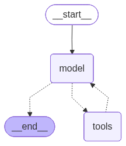

# langchain_practise_v1.2.3

In this repo I am capturing all the little learnings I have looked into in the latest langchain library

So I have explored the following topics 

- Basic use of create_agent function

    - Really love how you can make this image using langchain (more on middleware version of it later on)
- Model Integration
- Streaming and Batching
    - Streaming helps see the chat as llm produces the certain chunk at inference time instead of seeing at as a whole at the end
    - batching helps process multiple requests at once parallely and we can set a limit as to how many parallel must be taken at a time
- Tool creation
    - Here we can directly bind the tool with the certain model or we can use the **create_agent** module and it will automatically bind the tool with the model
- Tool Execution
- Types of Messages
    - We can invoke a **simple text prompt** ex model.invoke("what sort of model are you again ,give me a brief overview")
    - We can invoke a list of messages 
        - Types of messages that we can use in the list of messages **SystemMessage ,HumanMessage ,AIMessage ,ToolMessage**
        - We can usually invoke a list of these in the follow manner
        ex. 
        ```python
        messages = [
            SystemMessage(content="""You are a  model that says "yo u fine as hell" randomly in a convo """),
            HumanMessage(content="What is the capital of India?"),
        ]

        response = model.invoke(messages)
        ```

        - We can also set metadata for a certain message used
        ```python
        human_msg = HumanMessage(
                content="Hello there!",
                name= "Mathiastobias", # Optional this is to track the name of the user
                id = "message_1234" # Optional this is used to track the message
            )
        ```

        - We can also set a way to use tools message
        ```python
        ai_message = AIMessage(
            [],
            tool_calls = [{
                "name":"get_weather",
                "args":{"location":"san francisco"},
                "id":"call_123"# both the call id must match
            }]
        )

        weather_res = "BRRR its chilly"
        tool_resp = ToolMessage(
            content=weather_res,
            tool_call_id = "call_123"# both the call id must match
        )

        messages = [
            HumanMessage("what is the weather like in san francisco"),
            ai_message,
            tool_resp
        ]
        ```


- Model response with structured output 
    - Pydantic 
        - We can set a structure for which fields the output needs to have and how the output looks like .Here field validation will also happen .
    - TypeDict
        - Here instead of giving the response in a class manner we will be giving in a dictionary manner. So this is also giving in a structured output manner
